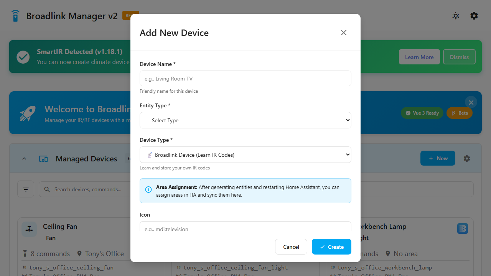
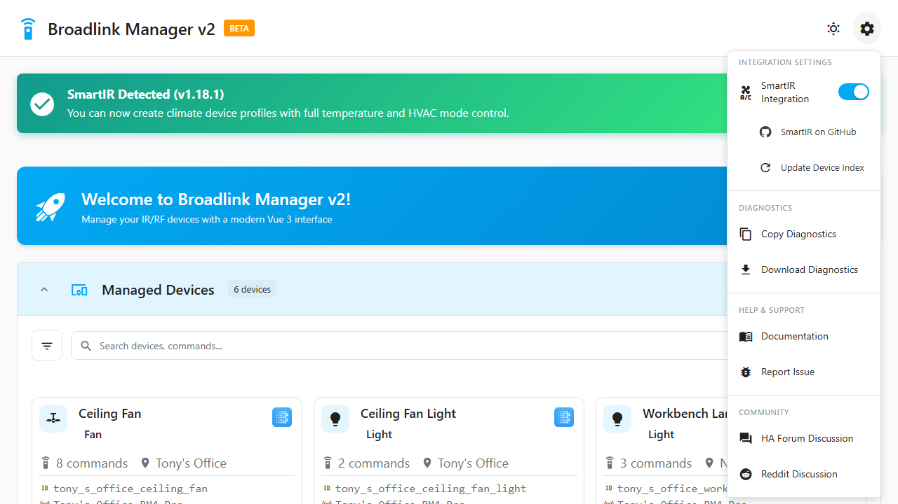
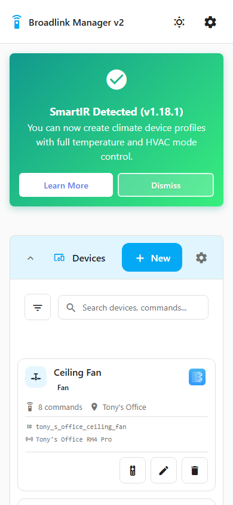
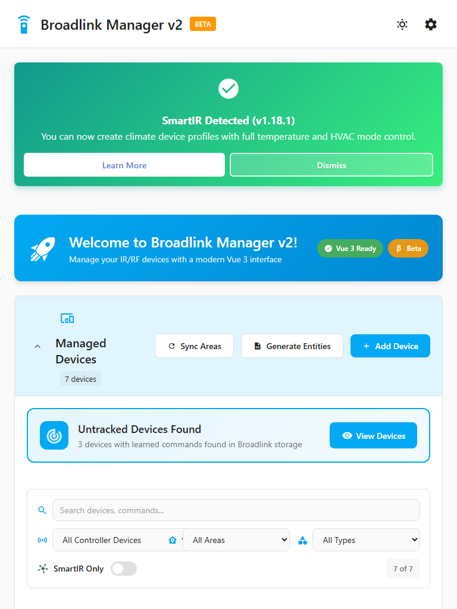

# Screenshot Reference

This document shows all available screenshots for use in documentation.

All screenshots are automatically generated using Playwright E2E tests. To update them, run:

```powershell
.\update-docs-screenshots.ps1
```

---

## Desktop Screenshots

### Dashboard Overview
**Path:** `docs/images/screenshots/dashboard-overview.png`  
**Size:** 1280x720 (Desktop)  
**Usage:** Main dashboard view with SmartIR integration


---

### Device List
**Path:** `docs/images/screenshots/device-list.png`  
**Size:** 1280x720 (Desktop)  
**Usage:** Device management page


---

### Create Device Modal
**Path:** `docs/images/screenshots/create-device-modal.png`  
**Size:** 1280x720 (Desktop)  
**Usage:** Add new device modal dialog


---

### Broadlink Device Form
**Path:** `docs/images/screenshots/broadlink-device-form.png`  
**Size:** 1280x720 (Desktop)  
**Usage:** Broadlink device creation form



---

### SmartIR Device Form
**Path:** `docs/images/screenshots/smartir-device-form.png`  
**Size:** 1280x720 (Desktop)  
**Usage:** SmartIR device creation form


---

### Settings Menu
**Path:** `docs/images/screenshots/settings-menu.png`  
**Size:** 1280x720 (Desktop)  
**Usage:** Settings dropdown menu



---

### SmartIR Status Card
**Path:** `docs/images/screenshots/smartir-status-card.png`  
**Size:** Component screenshot  
**Usage:** SmartIR integration status card


---

## Mobile & Tablet Screenshots

### Mobile Dashboard
**Path:** `docs/images/screenshots/mobile-dashboard.png`  
**Size:** 390x844 (iPhone 12/13 Pro)  
**Usage:** Mobile responsive view



---

### Tablet Dashboard
**Path:** `docs/images/screenshots/tablet-dashboard.png`  
**Size:** 768x1024 (iPad)  
**Usage:** Tablet responsive view



---

## Usage in Documentation

### Markdown
```markdown
# Full width


# Specific width

```

### HTML (if needed)
```html

```

---

## Updating Screenshots

Screenshots are automatically generated from E2E tests. To update:

1. Make UI changes
2. Run the update script:
   ```powershell
   .\update-docs-screenshots.ps1
   ```
3. Commit the updated screenshots:
   ```bash
   git add docs/images/screenshots/
   git commit -m "docs: update screenshots"
   ```

---

## Adding New Screenshots

To add new screenshots, edit `tests/e2e/test_documentation_screenshots.py`:

```python
def test_12_my_new_screenshot(self, page: Page, base_url, docs_screenshot_dir):
    """Capture my new feature"""
    page.goto(f"{base_url}/#/my-page")
    page.wait_for_load_state("networkidle")
    
    page.screenshot(
        path=str(docs_screenshot_dir / "my-new-feature.png")
    )
```

Then run the update script to generate it.
